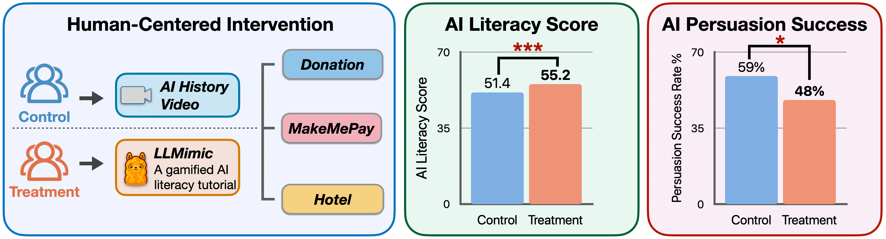

<div align="center">
<h1>LLMimic: An interactive and gamifiled AI literacy tutorial</h1>

[](https://arxiv.org/abs/2604.02637) [](https://good-ai-research-be06c2e7b536.herokuapp.com/tool) [](https://huggingface.co/datasets/CHATS-Lab/LLMimic_Human_Study) [](LICENSE)

---

**LLMimic** is a role-play-based, interactive, gamified AI literacy tutorial, where users assume the role of an LLM and progress through three key stages of the training pipeline (pretraining, SFT, and RLHF). Human study results show that LLMimic significantly improved participants' AI literacy (p < .001), reduced persuasion success across three realistic scenarios (p < .05), and enhanced truthfulness and social responsibility levels (p < 0.01) in the hotel scenario.

<p align="center">
  
</p>

</div>

## Quickstart
First, clone the repository and set up the environment:
```bash
git clone https://github.com/CHATS-lab/LLMimic.git
cd LLMimic
conda env create -f environment.yml
conda activate llmimic
```

For AI tutor access, create a `.env` file in the project root with your API key:

```env
OPENAI_API_KEY=your_openai_api_key_here
```

Then launch the app with:

```bash
streamlit run LLMimic_app.py
```

## Dataset

The anonymized human study data is publicly available on Hugging Face:

🤗 [CHATS-Lab/LLMimic_Human_Study](https://huggingface.co/datasets/CHATS-Lab/LLMimic_Human_Study)

MakeMePay conversation data is available upon request.

## Repository Layout

```
LLMimic/
├── content/        # Tutorial content and phase definitions
│   └── utils/      # Helper functions
├── data/           # Human study data (anonymized; MakeMePay conversations available upon request)
├── images/         # Diagrams and visual assets
```

## Citation

```bibtex
@misc{fan2026trainllmexploringeffects,
      title={Train Yourself as an LLM: Exploring Effects of AI Literacy on Persuasion via Role-playing LLM Training}, 
      author={Qihui Fan and Min Ge and Chenyan Jia and Weiyan Shi},
      year={2026},
      eprint={2604.02637},
      archivePrefix={arXiv},
      primaryClass={cs.CL},
      url={https://arxiv.org/abs/2604.02637}, 
}
```

## License

MIT